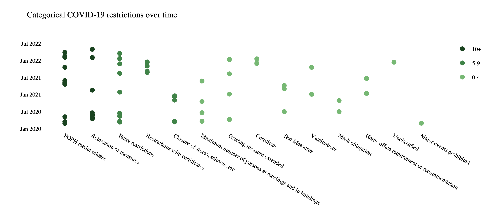
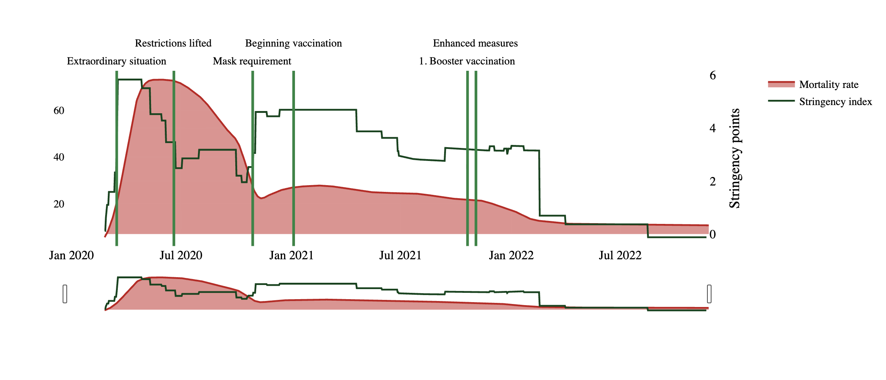

# COVID-19 Data Story

An interactive data visualization project exploring COVID-19 pandemic data through a web-based dashboard built with Dash and Plotly.

## Screenshots






## Features

- Interactive visualizations powered by Plotly
- Web-based dashboard using Dash
- COVID-19 data analysis including waves, extraordinary events, and restrictions
- Custom theming with color maps (Greens/Reds)
- Responsive design with custom CSS styling

## Data Sources

The project uses the following data files:
- `owid-covid-data.csv` - Our World in Data COVID-19 dataset
- `covid-waves.json` - COVID wave definitions
- `extraordinary-events.json` - Notable events during the pandemic
- `wikipedia_restrictions.json` - Restriction measures data
- `rgb-name-map.json` - Color mapping for visualizations

## Getting Started

### Prerequisites

- Python 3.x
- Jupyter Notebook

### Installation

1. Clone the repository
2. Install the required packages:
   ```bash
   pip install -r requirements.txt
   ```

### Running the Application

1. Open and run all cells in `covid_data_story.ipynb`
2. Dash will provide the local host URL (typically `http://127.0.0.1:8050/`)
3. Open the URL in your browser to view the interactive data story

## Project Structure

```
├── covid_data_story.ipynb    # Main notebook with visualizations and Dash app
├── requirements.txt          # Python dependencies
├── assets/
│   ├── style.css            # Custom styling for the Dash app
│   └── favicon.png          # Browser tab icon
└── data/
    ├── owid-covid-data.csv
    ├── covid-waves.json
    ├── extraordinary-events.json
    ├── wikipedia_restrictions.json
    └── rgb-name-map.json
```

## Technologies Used

- **Pandas** - Data manipulation and analysis
- **Plotly** - Interactive visualizations
- **Dash** - Web application framework
- **NumPy** - Numerical computing
- **SciPy** - Scientific computing
- **Matplotlib** - Color map generation
